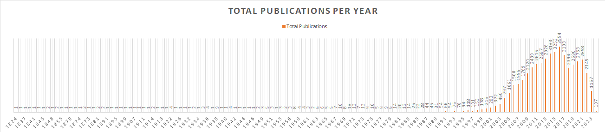
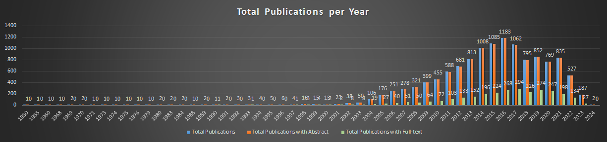
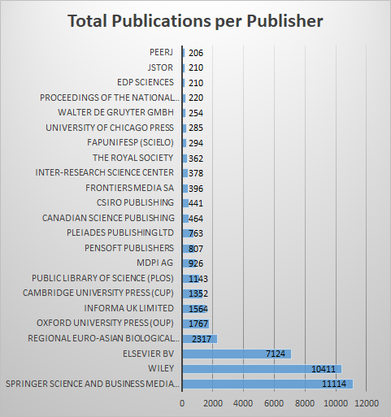
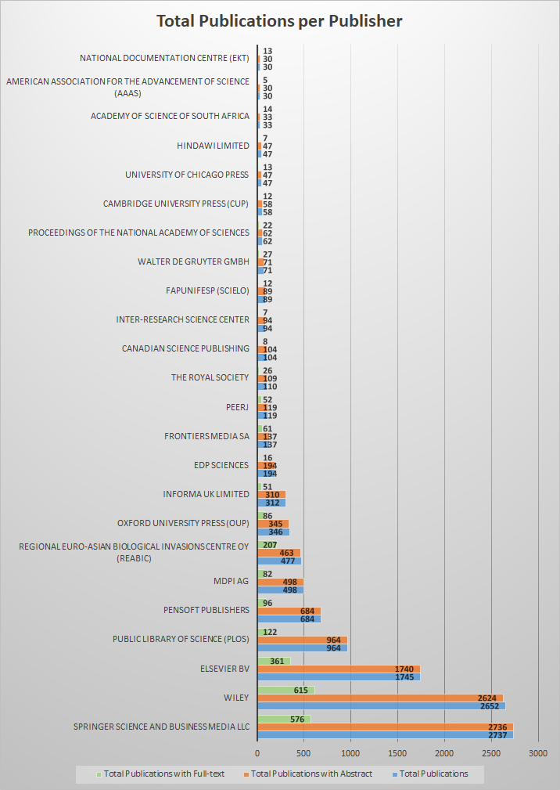

# Aim 🎯
The goal of this project is to evaluate the availability of full-text from [ASK ORKG](https://ask.orkg.org/) for publications in the [Invasion Biology Corpus](https://zenodo.org/records/12518037), with the aim of compiling a corpus for text data mining (TDM).

## Step 1: Initial Data Analysis 📊
Perform an initial analysis using only the available metadata.

### Task: Metadata Acquisition
Obtain the metadata for the publications in the Invasion Biology Corpus using:
- **Crossref API**: A comprehensive registry providing metadata for publications. See [Crossref API Documentation](https://api.crossref.org/swagger-ui/index.html).
- **Wikidata**: The initial publication list of DOIs was compiled here, but for completeness, we prefer Crossref due to its more curated and extensive metadata.

#### Metadata Acquisition Process
- The script used for fetching additional metadata from Crossref: [publications-crossref-metadata-search.py](https://github.com/jd-coderepos/invasion-biology-tdm-dataset/tree/main/scripts/publications-crossref-metadata-search.py)
- DOIs were sourced from the original list at [wikidata-invasion-biology-corpus/Publications.csv](https://github.com/jd-coderepos/invasion-biology-tdm-dataset/tree/main/wikidata-invasion-biology-corpus/Publications.csv).
- 📂 **The dataset obtained from Crossref is stored in:** [crossref-metadata/publications_metadata.csv](https://github.com/jd-coderepos/invasion-biology-tdm-dataset/blob/main/data/all-publications/crossref-metadata/publications_metadata.csv)
- A list of 273 publication DOIs that were not registered at Crossref is available at: [crossref-metadata/failed_dois.csv](https://github.com/jd-coderepos/invasion-biology-tdm-dataset/blob/main/data/all-publications/crossref-metadata/failed_dois.csv).


#### Additional Query 🌐

Check and compare publication dates and full-text links on Wikidata: [Wikidata Query](https://w.wiki/Bae3).


## Step 2: Compiling a Text Data Mining Corpus using ASK.ORKG.ORG 🛠️📚

In this step, we'll use the DOIs metadata file compiled from Crossref to query the ASK.ORKG.ORG API for abstracts and full-text records. Specifically, we will use the [Explore Documents](https://api.ask.orkg.org/docs#tag/Semantic-Neural-Search/operation/explore_documents_index_explore_get) endpoint to retrieve the data.

In this step, we will use the Crossref metadata file to query the [ASK ORKG](https://ask.orkg.org/) [API](https://api.ask.orkg.org/docs) for abstracts and full-text records. The [Explore Documents](https://api.ask.orkg.org/docs#tag/Semantic-Neural-Search/operation/explore_documents_index_explore_get) endpoint retrieves this data.

### Task: Testing with Example DOIs 📝

Test the ASK API with specific DOIs by running the script [scripts/ask-query-doi-fulltext-search.py](https://github.com/jd-coderepos/invasion-biology-tdm-dataset/blob/main/scripts/ask-query-doi-fulltext-search.py). The script checks whether the DOI is available in the ASK database, and if so, returns information on abstract and full-text availability.

Here are a few example runs (as of 19-10-2024):

#### Example 1: No Records Found ❌

```bash
../invasion-biology-tdm-dataset/scripts>python ask-doi-fulltext-search.py
Please enter the DOI: 10.1007/BF00383770
Retrieved 0 out of 0 records
No records found for DOI: 10.1007/BF00383770
```

The above run shows that the DOI was not found in the ASK database.

#### Example 2: Record Found, No Full-text Available ⚠️

```bash
../invasion-biology-tdm-dataset/scripts>python ask-doi-fulltext-search.py
Please enter the DOI: 10.1002/1878-0261.12019
Retrieved 2 out of 2 records
ID: 586962788, DOI: 10.1002/1878-0261.12019, Title: Modes of invasion during tumour dissemination, Year: 2017
Abstract is available. Token count: 90
Full-text is not available.
ID: 586962788, DOI: 10.1002/1878-0261.12019, Title: Modes of invasion during tumour dissemination, Year: 2017
Abstract is available. Token count: 90
Full-text is not available.
```

In this run, the record was found in the ASK database, but the full-text was not available. Note that there were two duplicate entries for this DOI.

#### Example 3: Record Found, Full-text Available ✔️

```bash
../invasion-biology-tdm-dataset/scripts>python ask-doi-fulltext-search.py
Please enter the DOI: 10.1002/2688-8319.12147
Retrieved 6 out of 6 records
ID: 521018861, DOI: 10.1002/2688-8319.12147, Title: Bringing back the Manchester Argus Coenonympha tullia ssp. davus (Fabricius, 1777): quantifying the habitat resource requirements to inform the successful reintroduction of a specialist peatland butterfly, Year: 2022
Abstract is available. Token count: 217
Full-text is available. Token count: 8305
...
```

Here, the record was found in the ASK database, and both the abstract and full-text were available. However, there were six duplicate entries for this DOI.

### Task: Query ASK for a List of DOIs 📄🔍

Query the ASK database for a list of DOIs using the script scripts/ask-doi-list-fulltext-search.py](../scripts/ask-doi-list-fulltext-search.py). This script prompts for:

1. **Path to a CSV file** containing DOIs in a column named "DOI" or "doi."
2. **Paths to output files** for:
  - Full-text results.
  - DOIs not found in ASK.
  - Errors encountered during the query process.
  - Logging processed DOIs.

#### Example Run ▶️

```bash
../invasion-biology-tdm-dataset/scripts>python ask-doi-list-fulltext-search.py
Please enter the path to the input CSV file containing DOIs: ../data/all-publications/crossref-metadata/publications_metadata.csv
Please enter the path to the output CSV file: ../data/all-publications/ask-fulltext/publications_tdm.csv #this resulting data file is released on zenodo
Please enter the path to the CSV file to log DOIs not found in ASK: ../data/all-publications/ask-fulltext/publications_notin_ASK.csv
Please enter the path to the CSV file to log errors: ../data/all-publications/ask-fulltext/publications_ASK_query_error.csv
Please enter the path to the CSV file to log processed DOIs: ../data/all-publications/ask-fulltext/queried_DOIs.csv
```

#### Data & Stats 📈

📂 **The TDM dataset obtained from ASK with abstracts and full-text is released on Zenodo at:** [10.5281/zenodo.13956882](https://www.doi.org/10.5281/zenodo.13956882).

Note: the data file is hosted on zenodo due to github repository storage limits.

Out of a total of 49,438 queried DOIs, the statistics for those found in the ASK database are as follows:

- **Total DOIs processed**: 12,636
  - DOIs with no abstracts or full-text: 36 (abstract token count was less than 10)
  - DOIs with abstracts but no full-text: 9,766
  - DOIs with both abstracts and full-text: 2,816

| Statistic                   | Abstract Length (tokens) | Full-text Length (tokens) |
|------------------------------|--------------------------|---------------------------|
| **Min Length**               | 10                       | 28                        |
| **Max Length**               | 1,608                    | 123,958                   |
| **Average Length**           | 235.47                   | 7,667.09                  |


### Data Visualization 🔬📈

For the 12,600 publications retrieved from ASK (i.e., those with at least an abstract), we visualize the number of publications per year and per publisher. 

To generate the data for plotting, map DOIs between ASK and the Crossref metadata file using the script [data-plots/scripts/plot-ask-category-counts.py]([../data-plots/scripts/plot-ask-category-counts.py]). Ensure you've downloaded the TDM Publications ASK output file from zenodo ([10.5281/zenodo.13956882](https://www.doi.org/10.5281/zenodo.13956882)).

```bash
..\invasion-biology-tdm-dataset\data-plots\scripts>python plot-ask-category-counts.py
Enter the path for the Crossref metadata file: ../../data/all-publications/crossref-metadata/publications_metadata.csv
Enter the path for the ASK publications file: ask_publications_tdm.csv #you need to specify the path you download this file to
Enter the output file name (e.g., publication_counts_by_category.csv): ../data/ask_publication_counts_by_publisher.csv
Enter the column name to count publications by (e.g., Publisher): Published Year
Output written to ../data/ask_publication_counts_by_publisher.csv
```

```bash
..\invasion-biology-tdm-dataset\data-plots\scripts>python plot-ask-category-counts.py
Enter the path for the Crossref metadata file: ../../data/all-publications/crossref-metadata/publications_metadata.csv
Enter the path for the ASK publications file: ask_publications_tdm.csv #you need to specify the path you download this file to
Enter the output file name (e.g., publication_counts_by_category.csv): ../data/ask_publication_counts_by_publisher.csv
Enter the column name to count publications by (e.g., Publisher): Publisher
Output written to ../data/ask_publication_counts_by_publisher.csv
```

The plots below juxtapose views of the original Crossref metadata dataset compiled from the Invasion Biology WikiProject compiled publication DOIs versus those that could be found in the ASK ORKG database w.r.t. their content i.e. abstract or full-text for text data mining (tdm) purposes.


#### Publications Per Year
<table>
  <tr>
    <td align="center">
      
      <br>
      <sub><em>**Figure 1:** Crossref Publications per Year. Data for this plot was generated by <a href="https://github.com/jd-coderepos/invasion-biology-tdm-dataset/blob/main/data-plots/scripts/plot-crossref-category-counts.py">plot-crossref-category-counts.py</a>, using data from <a href="https://github.com/jd-coderepos/invasion-biology-tdm-dataset/blob/main/data-plots/data/crossref_publication_counts_by_year.csv">crossref_publication_counts_by_year.csv</a>.</em></sub>
    </td>
  </tr>
  <tr>
    <td align="center">
      
      <br>
      <sub><em>**Figure 2:** ASK Publications per Year. Data for this plot was generated by <a href="https://github.com/jd-coderepos/invasion-biology-tdm-dataset/blob/main/data-plots/scripts/plot-ask-category-counts.py">plot-ask-category-counts.py</a>, using data from <a href="https://github.com/jd-coderepos/invasion-biology-tdm-dataset/blob/main/data-plots/data/ask_publication_counts_by_year.csv">ask_publication_counts_by_year.csv</a>.</em></sub>
    </td>
  </tr>
</table>


#### Publications Per Publisher

<table>
  <tr>
    <td align="center">
      
      <br>
      <sub><em>**Figure 1:** Crossref Publications per Publisher. Data for this plot was generated by <a href="https://github.com/jd-coderepos/invasion-biology-tdm-dataset/blob/main/data-plots/scripts/plot-crossref-category-counts.py">plot-crossref-category-counts.py</a>, using data from <a href="https://github.com/jd-coderepos/invasion-biology-tdm-dataset/blob/main/data-plots/data/crossref_publication_counts_by_publisher.csv">crossref_publication_counts_by_publisher.csv</a>. Note: This plot only includes publishers with at least 200 publications, representing 23 out of a total of 1020 unique publishers.</em></sub>
    </td>
    <td align="center">
      
      <br>
      <sub><em>**Figure 2:** ASK Publications per Publisher. Data for this plot was generated by <a href="https://github.com/jd-coderepos/invasion-biology-tdm-dataset/blob/main/data-plots/scripts/plot-ask-category-counts.py">plot-ask-category-counts.py</a>, using data from <a href="https://github.com/jd-coderepos/invasion-biology-tdm-dataset/blob/main/data-plots/data/ask_publication_counts_by_publisher.csv">ask_publication_counts_by_publisher.csv</a>. Note: This plot only includes publishers with at least 30 publications, representing 25 out of a total of 332 unique publishers.</em></sub>
    </td>
  </tr>
</table>


## Step 3: Compiling a Text Data Mining Corpus using Semantic Scholar

Another potential source to compile a TDM corpus is Semantic Scholar. In this case the relevant API endpoints is paper title search [https://api.semanticscholar.org/graph/v1/paper/search/match](https://api.semanticscholar.org/graph/v1/paper/search/match).

[to be continued...]